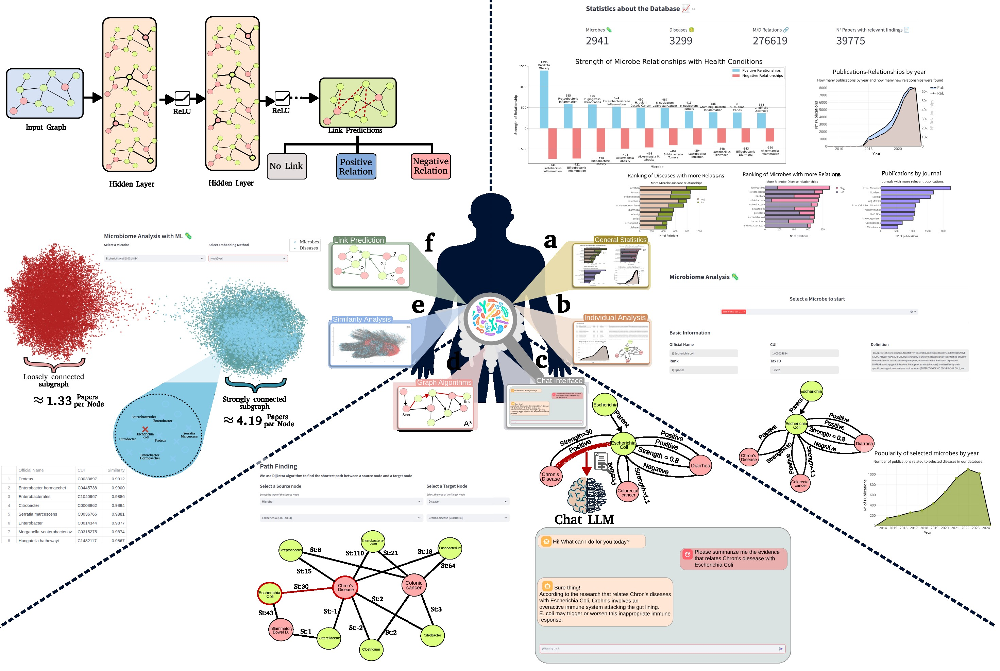

# MINERVA
MINERVA: Microbiome Network Research &amp; Visualization Atlas

Minerva is an automatically constructed platform for microbe-disease associations that leverages 
a fine-tuned LLM along with a NLP extraction pipeline to extract associations from the scientific literature.

The platform, the data, and the weights of all the models will be available upon the acceptance of the publication.
